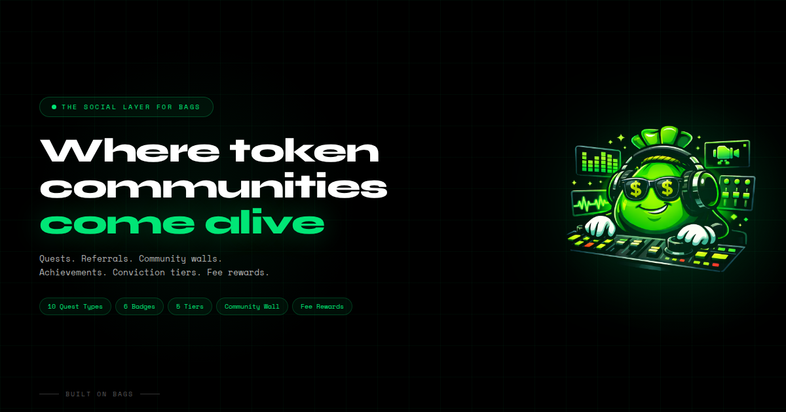
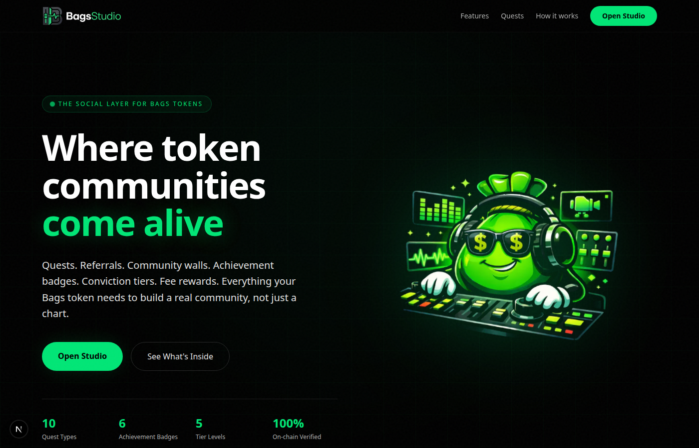
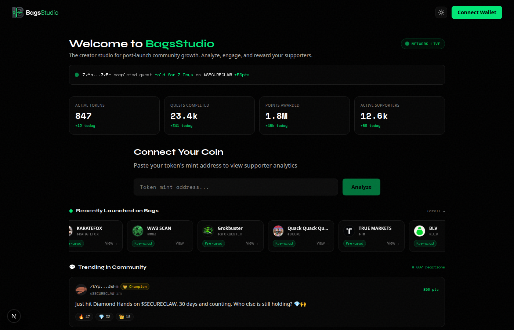
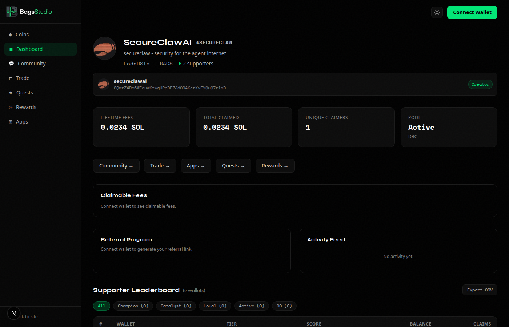
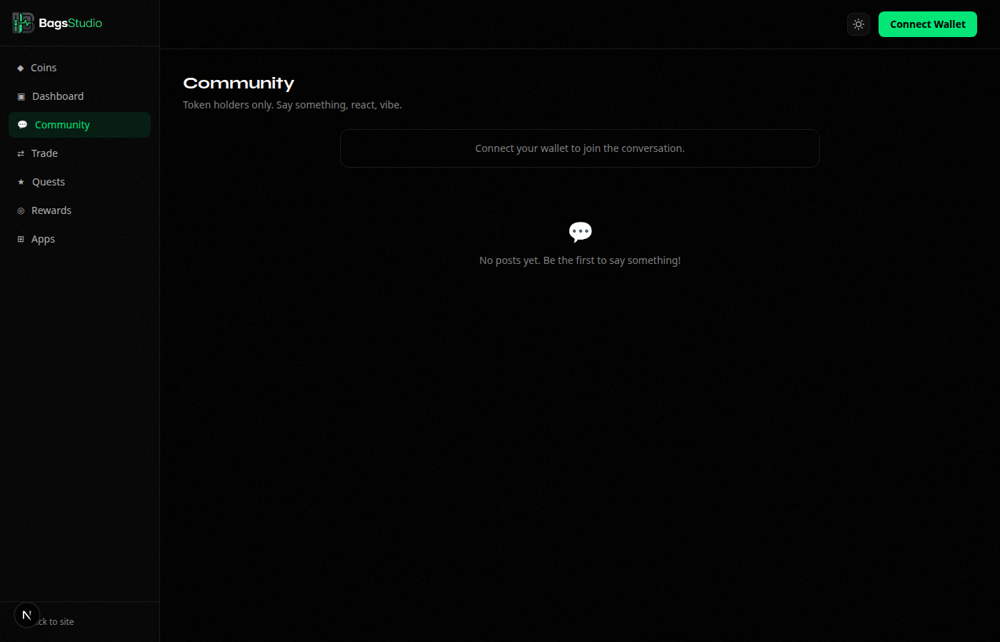
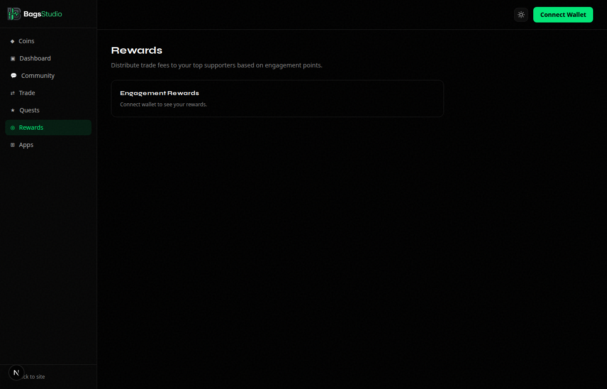

<p align="center">
  
</p>

<h1 align="center">BagsStudio</h1>

<p align="center">
  <strong>The social engagement layer for Bags tokens.</strong><br/>
  Quests. Referrals. Community walls. Achievement badges. Conviction tiers. Fee rewards.<br/>
  Everything your token needs to build a real community.
</p>

<p align="center">
  <a href="#features">Features</a> ·
  <a href="#screenshots">Screenshots</a> ·
  <a href="#tech-stack">Tech Stack</a> ·
  <a href="#getting-started">Getting Started</a> ·
  <a href="#architecture">Architecture</a> ·
  <a href="#roadmap">Roadmap</a>
</p>

---

## Features

### Community Wall
Token-gated social feed per token. Only holders can post, anyone can react. Five emoji reactions with optimistic UI. Click any wallet to view their full profile card.

### Gamified Quests (10 types)
All server-side verified. No client-side cheating.

| Quest Type | Verification |
|---|---|
| Token Balance | On-chain via Solana RPC |
| Holding Streak | Streak tracker in DB |
| Trade Volume | Trade logs from platform swaps |
| Referral Count | Verified referrals table |
| Hold Duration | Streak tracker in DB |
| Claim Count | Engagement points ledger |
| Tier Reached | Leaderboard rank percentile |
| Complete Quests | Meta: count other completions |
| Social Share | Manual creator approval |
| Custom | Manual creator approval |

### Achievement Badges
Six badges auto-awarded when conditions are met:

- **OG Holder** : Among the first 100 supporters
- **Diamond Hands** : 30+ day holding streak
- **Quest Master** : 5+ quests completed
- **Evangelist** : 10+ verified referrals
- **Whale** : Top 1% on leaderboard
- **Social Butterfly** : 10+ community posts

### Conviction Scoring
Five tiers based on balance (50pts), claim consistency (30pts), and claim history (20pts):

| Tier | Percentile | Color |
|---|---|---|
| Champion | Top 1% | Gold |
| Catalyst | Top 5% | Purple |
| Loyal | Top 15% | Green |
| Active | Top 40% | Blue |
| OG | Rest | Gray |

### Fee Rewards
Trade fees accumulate in a vault wallet via Bags AMM fee-share. Weekly epochs distribute SOL pro-rata based on engagement points. Guided setup flow for creators.

### Referral Engine
Each holder gets a unique referral link. Referrals are verified on-chain (referred wallet must actually hold the token). Both parties earn points.

### Profile Cards
Click any wallet on the leaderboard or community wall to see their full profile: tier badge, points breakdown, streak, quest count, referral count, post count, and earned achievement badges.

### Dark/Light Mode
Full theme toggle with CSS variable indirection for Tailwind v4 compatibility. Persists to localStorage.

---

## Screenshots

<table>
  <tr>
    <td></td>
    <td></td>
  </tr>
  <tr>
    <td align="center"><em>Landing Page</em></td>
    <td align="center"><em>Studio Home</em></td>
  </tr>
  <tr>
    <td></td>
    <td></td>
  </tr>
  <tr>
    <td align="center"><em>Token Dashboard</em></td>
    <td align="center"><em>Community Wall</em></td>
  </tr>
  <tr>
    <td></td>
    <td></td>
  </tr>
  <tr>
    <td align="center"><em>Quests</em></td>
    <td align="center"><em>Rewards</em></td>
  </tr>
</table>

---

## Tech Stack

| Layer | Technology |
|---|---|
| Framework | [Next.js 16](https://nextjs.org) (App Router, Turbopack) |
| Database | [Supabase](https://supabase.com) (PostgreSQL + RLS) |
| Chain | [Solana](https://solana.com) mainnet via [Helius](https://helius.dev) RPC |
| Wallet | `@solana/wallet-adapter` (Phantom, Solflare) |
| Styling | [Tailwind CSS 4](https://tailwindcss.com) with CSS variable theming |
| Animations | [Framer Motion](https://www.framer.com/motion) |
| Data Fetching | [SWR](https://swr.vercel.app) |
| Testing | [Playwright](https://playwright.dev) |

---

## Getting Started

### Prerequisites

- Node.js 18+
- [Bags API key](https://docs.bags.fm)
- [Supabase](https://supabase.com) project
- [Helius](https://helius.dev) API key (optional, falls back to public RPC)

### Setup

```bash
git clone https://github.com/your-org/bags-studio.git
cd bags-studio
npm install

cp .env.example .env
# Fill in BAGS_API_KEY, SUPABASE_*, HELIUS_API_KEY, CRON_SECRET

# Run schema migration in Supabase SQL Editor
# (copy supabase-schema.sql)

npm run dev
```

Open [http://localhost:3000](http://localhost:3000).

### Environment Variables

| Variable | Required | Description |
|---|---|---|
| `BAGS_API_KEY` | Yes | Bags public API key |
| `HELIUS_API_KEY` | No | Helius RPC key (faster + higher limits) |
| `NEXT_PUBLIC_SUPABASE_URL` | Yes | Supabase project URL |
| `NEXT_PUBLIC_SUPABASE_ANON_KEY` | Yes | Supabase anon (public) key |
| `SUPABASE_SERVICE_KEY` | Yes | Supabase service role key (server-side writes) |
| `CRON_SECRET` | Yes | Auth token for cron job endpoints |

---

## Architecture

```
┌──────────────────────────────────────────────────────┐
│                 BagsStudio Frontend                  │
│  Landing · Studio · Dashboard · Community · Quests   │
│  Trade · Rewards · Referrals · Profiles              │
└───────────────────┬──────────────────────────────────┘
                    │
┌───────────────────▼──────────────────────────────────┐
│              Next.js API Routes (30+)                │
│  /api/engage/[mint]/community    (posts, reactions)  │
│  /api/engage/[mint]/quests       (CRUD, check, submit)│
│  /api/engage/[mint]/profile      (aggregated profile)│
│  /api/engage/[mint]/referral     (codes, verify)     │
│  /api/engage/[mint]/rewards      (vault, epochs)     │
│  /api/trade  /api/launch  /api/fees  /api/cron       │
└──┬──────────┬──────────┬─────────────────────────────┘
   │          │          │
   ▼          ▼          ▼
 Bags API   Solana     Supabase (15 tables)
 (launch,   RPC        (points, quests, community,
  trade,    (balance    referrals, achievements,
  fees)     verify)     streaks, rewards, feed)
```

### Database (15 tables)

| Table | Purpose |
|---|---|
| `engagement_points` | Append-only points ledger |
| `engagement_leaderboard` | Materialized leaderboard with decay |
| `quests` | Creator-defined quests (10 types) |
| `quest_completions` | One-per-wallet completion records |
| `quest_submissions` | Proof submissions for approval quests |
| `community_posts` | Token-gated social wall |
| `post_reactions` | Emoji reactions on posts |
| `achievements` | Earned badge records |
| `referral_codes` | Unique referral codes per wallet |
| `referrals` | Referral tracking (pending/verified) |
| `holding_streaks` | Current and longest streaks |
| `reward_vaults` | Vault config per token |
| `reward_epochs` | Weekly distribution snapshots |
| `reward_claims` | Individual pro-rata claims |
| `trade_logs` | Swap logs for volume tracking |

### Key Design Decisions

- **Non-custodial**: Users sign all transactions via wallet adapter. The server never holds keys.
- **Server-side verification**: Quest completions verified on the server using on-chain data and Solana RPC. No client-trusted values.
- **Append-only points**: Engagement points are an immutable ledger. The leaderboard is a materialized view with 10%/month decay.
- **Token-gated posting**: Community wall requires on-chain token balance > 0 to post. Reactions are open to everyone.
- **On-chain referral verification**: Referrals only verify when the referred wallet actually holds the token, checked via Solana RPC.

---

## Cron Jobs

| Endpoint | Schedule | Purpose |
|---|---|---|
| `POST /api/cron/daily-refresh` | Daily | Update streaks, award hold/streak points, refresh leaderboard |
| `POST /api/cron/weekly-rewards` | Weekly | Check vault balances, create reward epochs |

Both require `Authorization: Bearer <CRON_SECRET>`.

---

## Roadmap

### Coming Soon: One-Click Staking

- Creator sets up a staking vault in one click
- Supporters stake tokens, accumulate weight over time
- Stake weight = amount x duration
- Proportional share of trade fees distributed to stakers
- Staking leaderboard with real-time rankings
- Auto-compounding rewards

### Formula

```
your_share = (stake_amount x days_staked) / total_weighted_stake x fee_pool
```

---

## Scripts

```bash
npm run dev       # Start dev server (Turbopack)
npm run build     # Production build
npm run start     # Start production server
npm run lint      # ESLint
```

## License

MIT

---

<p align="center">
  Built for the <a href="https://bags.fm">Bags Hackathon 2026</a>. Powered by Bags.
</p>
